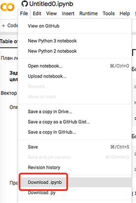

## 🤖 Введение в машинное обучение

В этом репозитории вы найдёте все материалы для курса.

### Быстрые ссылки

💬 [Mattermost](https://mattermost.westeurope.cloudapp.azure.com/signup_user_complete/?id=otqt5qwp9fbbpj3n4hzyc4hp6h) для общения участников курса и преподавателей.

📺 [Запись первой лекции](https://www.youtube.com/watch?v=6lH9u5gLOv0) 

📺 [Запись второй лекции](https://www.youtube.com/watch?v=1fiCrm5uJjg)

📺 [Трансляция третьей лекции](https://youtu.be/4gthmN3BfRw) 12 декабря в 16:00 Мск

📚 [Как делать домашки](https://github.com/mts-machines-learn/ml-course-dec2019#%D0%BA%D0%B0%D0%BA-%D0%B4%D0%B5%D0%BB%D0%B0%D1%82%D1%8C-%D0%B4%D0%BE%D0%BC%D0%B0%D1%88%D0%BA%D0%B8)

### Расписание лекций

Время по Москве.

* ✔ 9 декабря, 16:00 — Введение. *Запись: https://youtu.be/6lH9u5gLOv0*
* ✔ 11 декабря, 16:00 — Настройка окружения, введение в Python. *Запись: https://youtu.be/1fiCrm5uJjg*
* 12 декабря, 16:00 — Математика и библиотеки для Data Science. *Трансляция: https://youtu.be/4gthmN3BfRw*
* 16 декабря, 16:00 — Линейная регрессия. Часть 1. 
* 17 декабря, 16:00 — Линейная регрессия. Часть 2.

### Как делать домашки

Для каждого урока, кроме первого, есть домашка, которую вы можете сделать и отправить нам. Мы проверим первые 100 домашек до 20 января 2020 г. Если их будет больше, то проверим все, но не сразу :)

#### Решаем ноутбук

В папке каждого урока есть файл `Homework_x.ipynb`, где `x` — номер урока. Это файл Jupyter Notebook, который вы можете открыть в Google Colab с помощью кнопки . Вы также можете клонировать весь репозиторий к себе на диск и открывать ноутбуки локально 🕶.

#### Отправляем домашку

Когда вы получили готовый ноутбук с домашкой, просто отправьте его нам в аттаче на почту mlcourse@mts.ru с любой темой.

**Внимание!** Пожалуйста, проследите, что ваш файл называется `Homework_x.ipynb`, где `x` — номер урока. В противном случае, наш скрипт расстроится и мы не сможем проверить вашу домашку :(

Больше ничего делать не нужно! Мы вам напишем, как только проверим домашку.

#### Подробнее про Google Colab

После того, как вы нажали на кнопку  и у вас открылся ноутбук, запустите первую ячейку с кодом с помощью Shift+Enter. Colab предупредит, что вы открываете ноутбук с GitHub. Мы это и так знаем, поэтому жмите “Run anyway”.

Вы можете редактировать ноутбук без сохранения, или скопировать его себе на Google Drive (это не обязательно). Когда закончите работать над домашкой, скачайте получившийся ноутбук:

**Внимание!** Colab портит имена файлов, поэтому переименуйте загруженный файл в формате `Homework_x.ipynb`, где `x` — номер урока.